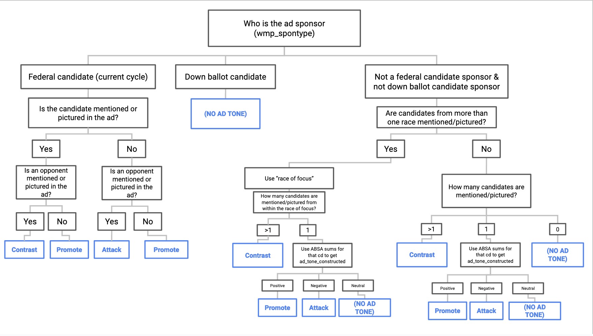

# CREATIVE --- Ad Tone

Welcome! This repo contains scripts for classifying political ads by ad tone (e.g., contrast, promote, attack).

This repo is part of the [Cross-platform Election Advertising Transparency Initiative (CREATIVE)](https://www.creativewmp.com/). CREATIVE is an academic research project that has the goal of providing the public with analysis tools for more transparency of political ads across online platforms. In particular, CREATIVE provides cross-platform integration and standardization of political ads collected from Google and Facebook. CREATIVE is a joint project of the [Wesleyan Media Project (WMP)](https://mediaproject.wesleyan.edu/) and the [privacy-tech-lab](https://privacytechlab.org/) at [Wesleyan University](https://www.wesleyan.edu).

To analyze the different dimensions of political ad transparency we have developed an analysis pipeline. The scripts in this repo are part of the Data Classification step in our pipeline.


**Note**: The scripts for ad tone mention-based (see below) all require the [candidates dataset](https://github.com/Wesleyan-Media-Project/datasets) to be cloned into the same top-level folder as the ad_tone repo. Depending on the specific script being run, scripts from other repos are also required, which is discussed in more detail in the Setup section of this readme.

**Note**: The scripts for concern ad_tone_constructed (see below) all require the [ABSA dataset](https://github.com/Wesleyan-Media-Project/ABSA) as well as the [race of focus dataset](https://github.com/Wesleyan-Media-Project/race_of_focus). In addition, mention-based ad tone is also needed (see above). Again, these are assumed to be cloned into the same top-level folder as the entity_linking repo.

**Note**: Some csv files in those repos are too large to be uploaded to GitHub. You can download them through our Figshare page.

## Table of Contents

[1. Introduction](#1-introduction)  
[2. Data](#2-data)  
[3. Setup](#3-setup)  
[4. Thank you!](#4-thank-you)

## 1. Introduction

This repository contains code that generates two variables: ad tone mention-based, which codes ad as 'contrast, 'promote' or 'attack', as well as ad tone constructed, which is based on this flowchart.



This repo contains eight R scripts, three that deal with ad tone constructed and five that deal with ad tone mention-based. Of the five scripts related to ad tone mention-based, three are in one folder called "ad_tone_mentionbased" and another two are in another folder called "ad_tone_mentionbased_2022". All of the files in "ad_tone_constructed" do equivalent things to each other, they just do so for different data, and the same is true for all of the ad tone mention-based files.

## 2. Data

The code in this repository creates two variables, ad tone mention-based, and ad tone constructed. Results are saved as a csv file, in the data folder.

### Ad tone mention-based

Mention-based (or reference-based) results in ads coded as 'Contrast' if both the candidate and their opponent are mentioned in the ad (either in text, or in image appearance), 'Promote' if only the candidate is mentioned, and 'Attack' if only the opponent is mentioned. If no candidate is mentioned, the ad is coded as 'Support' (given that the basic purpose of an ad is to further the preferred candidate's electoral prospects). This variable is available for the candidate ads in the 1.4m dataset.

### Ad tone constructed

The construction of ad tone is based on this flowchart.


When traditional mention-based ad tone is available, we use that; otherwise we sum over ABSA results (also using race of focus). The variable is available for a larger number of ads, and the rest have no ad tone.

## 3. Setup

### 3.1 Install R and Packages

First, make sure you have R installed. In addition, while R can be run from the terminal, many people find it much easier to use r-studio along with R. A link to this program can be found [here](https://rstudio-education.github.io/hopr/starting.html)

The scripts use R (4.2.2).

Next, make sure you have the following packages installed in R (the exact version we used of each package is listed in the [requirements_r.txt file](https://github.com/Wesleyan-Media-Project/ad_tone/blob/main/requirements_r.txt)):

- data.table
- stringr
- purrr
- dplyr
- tidyr
- R.utils

### 3.2 Download Files Needed

In order to use the scripts in this repo, you will need to download the repository into a top level folder. In addition, depending on which scripts you are running, additional repositories will also be necessary. Specifically which repositories are needed depends on which script you are executing.

All the scripts for ad tone mention-based require [datasets](https://github.com/Wesleyan-Media-Project/datasets). In addition, depending on the specific script, various other repos must also be downloaded. Looking at those scripts found within the ad_tone_mentionbased folder, ad_tone_mentionbased/ad_tone_heuristic_tv_2020.R requires the [entity linking repo](https://github.com/Wesleyan-Media-Project/entity_linking). ad_tone_mentionbased/ad_tone_mentionbased_FB_140m.R requires [race of focus](https://github.com/Wesleyan-Media-Project/race_of_focus), [fb_2020](https://github.com/Wesleyan-Media-Project/fb_2020) and [entity linking](https://github.com/Wesleyan-Media-Project/entity_linking). ad_tone_mentionbased/ad_tone_mentionbased_Google_2020.R requires [race of focus](https://github.com/Wesleyan-Media-Project/race_of_focus), [entity linking](https://github.com/Wesleyan-Media-Project/entity_linking) and [google_2020](https://github.com/Wesleyan-Media-Project/google_2020). Some csv files in those repos are too large to be uploaded to GitHub. You can download them through our Figshare page.

Looking at the scripts within the ad_tone_mentionbased_2022 folder, they again all require [datasets](https://github.com/Wesleyan-Media-Project/datasets). In addition, depending on the specific script, various other repos must also be downloaded. Specifically, ad_tone_mentionbased_2022/ad_tone_mentionbased_fb2022.R requires the [entity linking 2022 repo](https://github.com/Wesleyan-Media-Project/entity_linking_2022) and the [data-post-production repo](https://github.com/Wesleyan-Media-Project/data-post-production). ad_tone_mentionbased_2022/ad_tone_mentionbased_g2022.R requires the [entity linking 2022 repo](https://github.com/Wesleyan-Media-Project/entity_linking_2022) as well, along with the [data-post-production repo](https://github.com/Wesleyan-Media-Project/data-post-production). Some csv files in those repos are too large to be uploaded to GitHub. You can download them through our Figshare page.

All the scripts in this repo that concern ad_tone_constructed require the [ABSA dataset](https://github.com/Wesleyan-Media-Project/ABSA) as well as the [race of focus dataset](https://github.com/Wesleyan-Media-Project/race_of_focus) and ad tone mention-based (see above). This includes ad_tone_constructed/ad_tone_constructed_fb140m.R, ad_tone_constructed/ad_tone_constructed_fb2022.R and ad_tone_constructed/ad_tone_constructed_g2022.R.

### 3.3 Run Files

Now, depending on which variable and what data you are interested in analyzing, choose which file to run and do so.

Running the scripts through the terminal would look like this

```bash
cd ad_tone_mentionbased
Rscript ad_tone_mentionbased_FB_140m.R
```

and can also alternatively be done through the RStudio interface.

## 4. Thank You

<p align="center"><strong>We would like to thank our supporters!</strong></p><br>

<p align="center">This material is based upon work supported by the National Science Foundation under Grant Numbers 2235006, 2235007, and 2235008.</p>

<p align="center" style="display: flex; justify-content: center; align-items: center;">
  <a href="https://www.nsf.gov/awardsearch/showAward?AWD_ID=2235006">
    
  </a>
</p>

<p align="center">The Cross-Platform Election Advertising Transparency Initiative (CREATIVE) is a joint infrastructure project of the Wesleyan Media Project and privacy-tech-lab at Wesleyan University in Connecticut.

<p align="center" style="display: flex; justify-content: center; align-items: center;">
  <a href="https://www.creativewmp.com/">
    
  </a>
</p>

<p align="center" style="display: flex; justify-content: center; align-items: center;">
  <a href="https://mediaproject.wesleyan.edu/">
    
  </a>
</p>

<p align="center" style="display: flex; justify-content: center; align-items: center;">
  <a href="https://privacytechlab.org/" style="margin-right: 20px;">
    
  </a>
</p>
